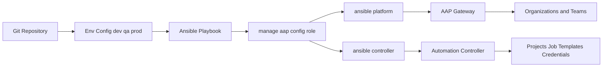
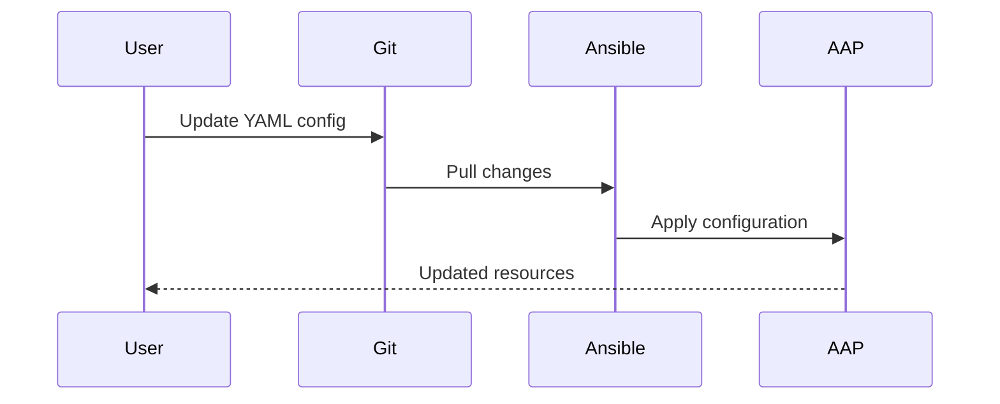

# 🚀 AAP GitOps Config Management


> Manage **Red Hat Ansible Automation Platform (AAP)** configuration as code using a GitOps approach.

---

## 🌟 Overview

This repository provides a **GitOps-based framework** for managing AAP configuration declaratively using Ansible.

It enables you to create, update, and delete:

* Organizations
* Teams
* Projects
* Job Templates
* Credentials

Across environments:

* `dev`
* `qa`
* `prod`

---

## 🧭 Architecture



---

## 🏗️ Repository Structure

```text
.
├── dev/
│   ├── playbooks/
│   │   └── manage-aap-config.yml
│   └── var_files/
│       ├── credential.yml
│       ├── job_templates.yml
│       ├── orgs.yml
│       ├── platform-info.yml
│       ├── projects.yml
│       └── teams.yml
├── qa/
├── prod/
└── roles/
    ├── manage-aap-config/
    └── delete-aap-config/
```

---

## ⚙️ How It Works

1. Define configuration in environment-specific YAML files
2. Run the playbook
3. Ansible roles apply the configuration to AAP

### Collections Used

* `ansible.platform` → Organizations, Teams
* `ansible.controller` → Projects, Job Templates, Credentials

---

## 📦 Prerequisites

* Ansible (latest recommended)
* Access to AAP 2.6
* Admin credentials

Install required collections:

```bash
ansible-galaxy collection install ansible.platform ansible.controller
```

---

## 🔧 Configuration

Each environment contains:

```text
<env>/var_files/
```

### Key Files

| File                | Purpose                |
| ------------------- | ---------------------- |
| `platform-info.yml` | AAP connection details |
| `orgs.yml`          | Organizations          |
| `teams.yml`         | Teams                  |
| `projects.yml`      | Projects               |
| `job_templates.yml` | Job templates          |
| `credential.yml`    | Credentials            |

---

## 🧪 Example Configuration

### platform-info.yml

```yaml
aap_hostname: "https://aap.example.com"
aap_username: "admin"
aap_password: "{{ vault_aap_password }}"
validate_certs: false
```

### orgs.yml

```yaml
organizations:
  - name: Demo Org
    description: Demo organization for GitOps
    state: present
```

### teams.yml

```yaml
teams:
  - name: Platform Team
    organization: Demo Org
    description: Platform engineers
    state: present
```

### projects.yml

```yaml
projects:
  - name: Demo Project
    organization: Demo Org
    scm_type: git
    scm_url: https://github.com/example/demo-repo.git
    scm_branch: main
    state: present
```

### credential.yml

```yaml
credentials:
  - name: Demo Machine Credential
    organization: Demo Org
    credential_type: Machine
    inputs:
      username: ec2-user
      password: "{{ vault_machine_password }}"
    state: present
```

### job_templates.yml

```yaml
job_templates:
  - name: Demo Job Template
    project: Demo Project
    inventory: Demo Inventory
    playbook: site.yml
    credential: Demo Machine Credential
    state: present
```

---

## ▶️ Usage

### Run Dev

```bash
ansible-playbook dev/playbooks/manage-aap-config.yml
```

### Run QA / Prod

```bash
ansible-playbook qa/playbooks/manage-aap-config.yml
ansible-playbook prod/playbooks/manage-aap-config.yml
```

---

## 🔄 Resource Lifecycle

### Create / Update

```yaml
state: present
```

### Delete

```yaml
state: absent
```

Deletion order:

1. Job Templates
2. Projects
3. Teams
4. Organizations

---

## 🧪 Demo Workflow



---

## ⚡ Quick Start

```bash
git clone https://github.com/taiseerhussein/import-config
cd import-config

ansible-galaxy collection install ansible.platform ansible.controller

ansible-playbook dev/playbooks/manage-aap-config.yml
```

---

## 🔐 Security Best Practices

* Use **Ansible Vault** for secrets:

```bash
ansible-vault create group_vars/all/vault.yml
```

* Never commit:

  * Passwords
  * Tokens
  * Private keys

---

## 🎯 Use Cases

* GitOps for AAP configuration
* Environment standardization
* AAP 2.4 → 2.6 migration
* Disaster recovery
* CI/CD-driven automation

---

## 📊 CI Example (GitHub Actions)

```yaml
name: Ansible Lint

on: [push, pull_request]

jobs:
  lint:
    runs-on: ubuntu-latest
    steps:
      - uses: actions/checkout@v3
      - run: pip install ansible ansible-lint
      - run: ansible-lint
```

---

## 🧹 .gitignore

```bash
.DS_Store
.env
*.retry
*.log
__pycache__/
```

---

## 📸 Screenshots

*Add screenshots from your AAP UI here:*

* Organizations
* Teams
* Job Templates

---

## 💡 Business Value

* Consistent environments
* Faster onboarding
* Reduced human error
* Full audit trail via Git
* Scalable automation

---

## 👤 Author

**Taiseer Hussein**
https://github.com/taiseerhussein

---
